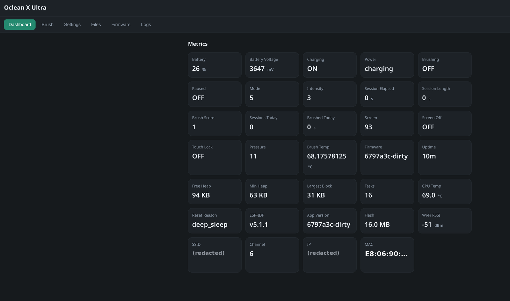
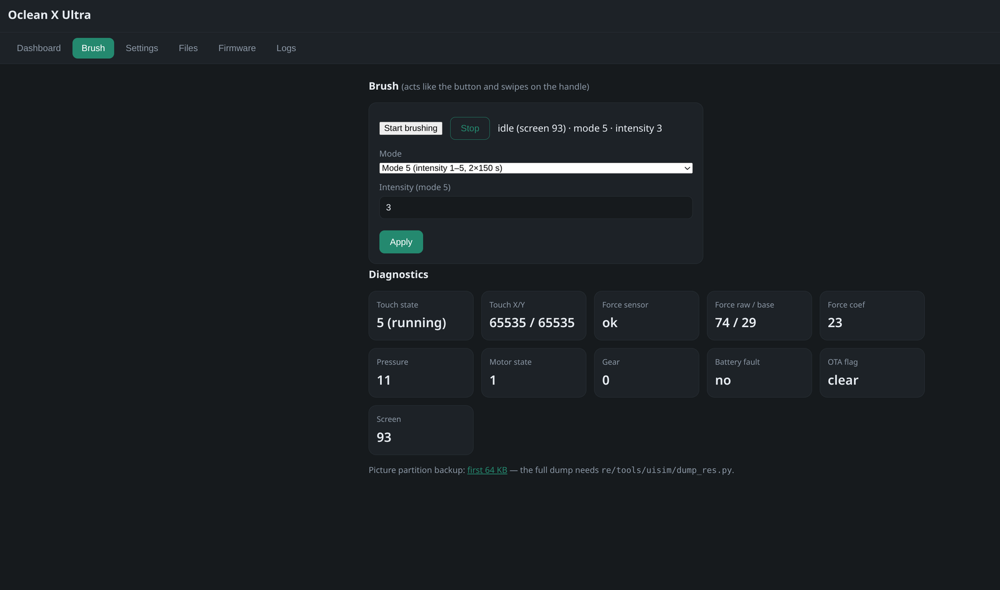
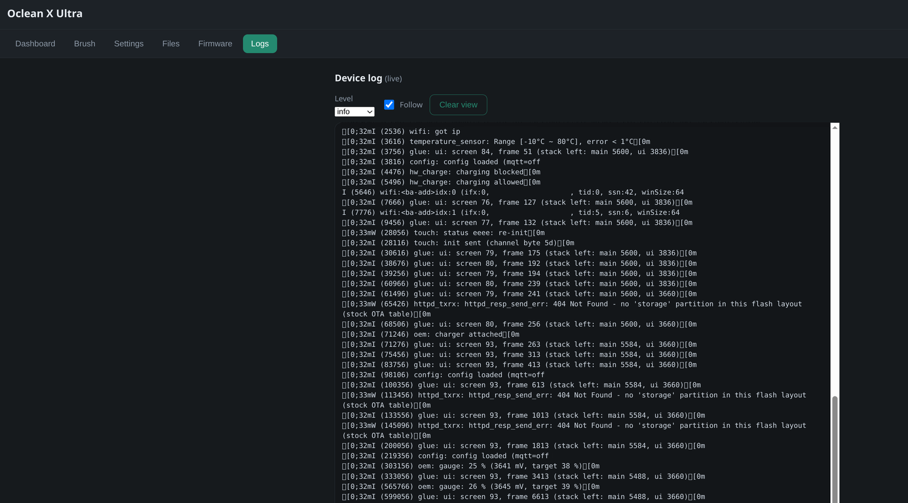
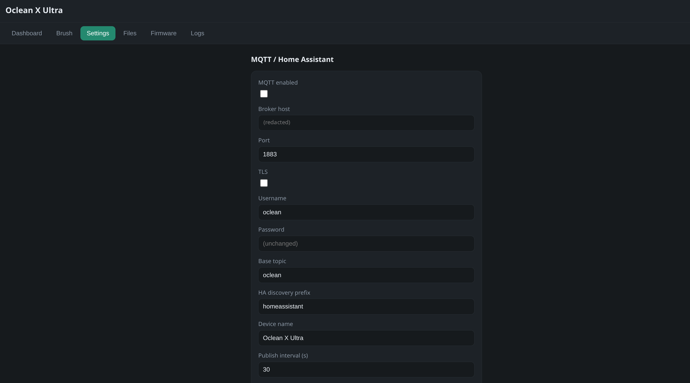
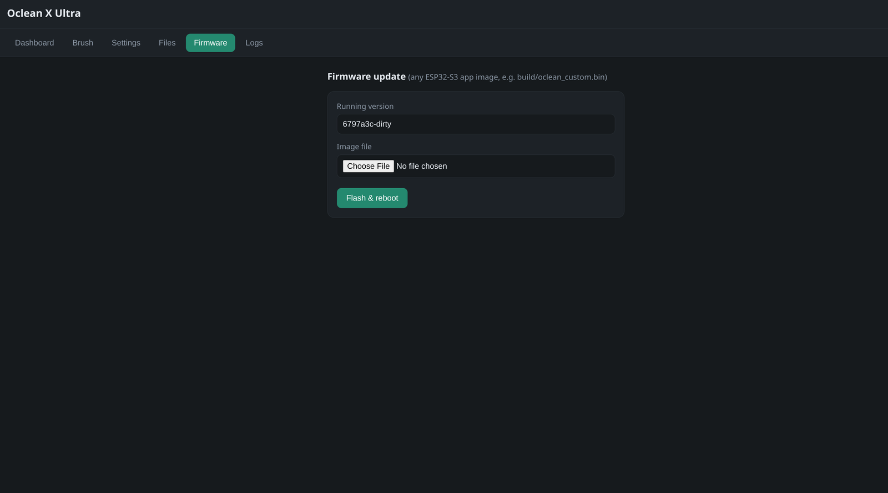
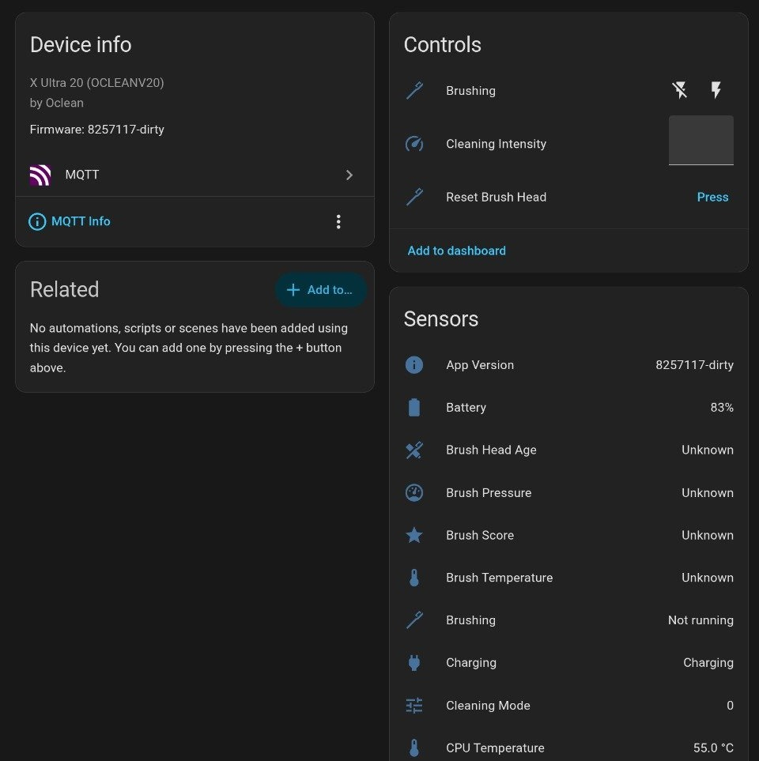

# Oclean X Ultra 20 — custom firmware (ESP32-S3)

Replacement firmware for the Oclean X Ultra 20 that re-implements the stock (OEM)
behaviour — the picture-based screen with its pages, touch swipes, brushing modes,
intensity, LEDs, charging display and automatic sleep / wake — and adds Wi-Fi, a web UI
and MQTT / Home Assistant. The OEM behaviour was recovered by decompiling
the stock image; the specs are in `re/spec/`.

## Status

**Running and verified on the device** (X Ultra 20). Confirmed from the brush's own web
API: it runs the custom firmware (not safe mode), the OEM picture partition is intact and
the screens composite from it (`oem_pictures:true`), charging is detected and enabled, the
battery gauge and IMU temperature read, the touch controller reaches its running state and
the force sensor answers, and it wakes from deep sleep. It also builds and runs in QEMU
(`re/spec/NOTES_glue.md`), and every core module has a host test under `re/tools/uisim/`.

Still to judge by using it (nobody can see the panel over the wire): the exact look of each
screen, the LED patterns, and the motor feel per mode. The web UI's Logs tab and the
Brush-tab diagnostics (touch state, force value, motor state, current screen id) are the
window into those without a serial port.

Stock behaviour that is **not** a fault: the brush turns its screen off about 36 s after a
wake and deep-sleeps ~30 s later (wake it with the button, a pick-up, or the charger;
loading the web page restarts the window); on the charger it never sleeps and only the
backlight times out; the clock page is empty without weather data. Set the time zone once
in Settings.

## Screenshots

### Web UI (served by the firmware on port 80)

<table>
<tr>
<td width="50%"><br><b>Dashboard</b> — live metrics from the brush: battery and charging, mode and intensity, the current screen id, sensors, Wi-Fi.</td>
<td width="50%"><br><b>Brush</b> — start / stop, mode and intensity (acts like the button and swipes on the handle), plus hardware diagnostics: touch controller state, force sensor, motor, screen.</td>
</tr>
<tr>
<td><br><b>Logs</b> — the live device log over Wi-Fi (no serial port needed): UI frames being composited, touch-controller init, charge enable, the battery gauge.</td>
<td><br><b>Settings</b> — MQTT / Home Assistant, Wi-Fi, the web UI password, the LCD panel table and the time zone.</td>
</tr>
<tr>
<td><br><b>Firmware</b> — over-the-air update; the brush shows the OEM update screens while it flashes.</td>
<td></td>
</tr>
</table>

### Home Assistant



The brush auto-discovered over MQTT, with its controls and every metric as Home Assistant
entities.

## Features
- **OEM parity** — stock screens (wake page, mode pages, brushing countdown, intensity,
  pause, score / history, charging, low battery, info, update, lock popup) composed from
  the brush's own picture partition; touch swipes (mode up/down, side pages left/right);
  button (short press start / pause, 2 s lock, 5 s info, 8 s factory reset); six brushing
  modes with the stock motor waveforms, zone cue and auto-stop; anti-splash and
  over-pressure handling from the force sensor; the four LEDs and backlight patterns;
  battery gauge, charging state and thermal cutoff; idle screen-off, deep sleep and wake on
  button / pick-up / charger. Not ported: voice clips (MP3), the IMU zone tracker (the
  score is time-based until zone data exists), OEM cloud, factory / shop-demo modes.
- **Web UI** (port 80) — dashboard, Brush tab (start / stop, mode, intensity,
  diagnostics), MQTT / Wi-Fi / panel settings, firmware update (shows the OEM update
  screens), live log, read-only copies of the flash partitions (Files tab; nvs only once a
  web password is set).
  Web password (Settings → Web UI): the brush joins its Wi-Fi network only once one is
  set. Without one (first setup, an update from an older build, after the 8 s hold) it
  comes up as the setup AP instead, where you set it together with the network; then it
  joins the network. Once set, the page, curl and scripts need it; a login lasts a year per
  browser and IP address (a new DHCP address, or the setup AP's 192.168.4.1, needs its
  own), also across deep sleep and updates, and a new password logs out every other
  browser. Forgot it? Hold the button for 8 s, also starting from sleep. That is the stock
  factory reset: it also clears the brushing history and the brush's own settings, and on
  battery the brush then goes to sleep (press the button to wake it). It comes back as the
  setup AP: join `oclean-setup` with the code on its screen and set a new password. In safe
  mode the hold clears only the password and restarts the brush. Safe mode without a
  password stays off your network too: it has no screen for the code, so its setup AP is
  open, and a repair then needs you in radio range. Open the brush by its
  IP address: host names are refused (DNS-rebinding protection), and so are cross-site
  POSTs. Plain HTTP, so the password is only as private as the network it crosses.
- **MQTT + Home Assistant** — auto-discovery of every metric; Brushing switch, Mode and
  Intensity numbers.
- **Wi-Fi** — joins the configured network with backoff; `oclean-setup` AP
  (http://192.168.4.1) when there are no credentials, no web password, or after a minute of
  failures. The AP
  is WPA3 (phones from Android 10 / iOS 13 on) with a new 9-digit passcode each time it
  comes up, shown on the brush's screen (press the button if it is dark). In safe mode,
  which has no screen, it is open.
- **Bluetooth** — off by default (`CONFIG_BT_ENABLED=n` in `sdkconfig.defaults`): nobody
  uses the phone app with this firmware, and the controller never slept, also on the
  charging dock. The GATT server for the phone app (Oclean service `8082caa8…`, best
  effort) is still in `main/ble_server.c`, which compiles to stubs without Bluetooth; the
  options that build it again are listed in `sdkconfig.defaults`.
- **Safety** — crash-loop guard (safe mode with web UI after 4 failed boots, revert to
  the other OTA slot after 8), stock NVS never erased wholesale, deep sleep refused on the
  charger or when the button wake cannot be armed.

## Hardware (recovered from the stock firmware, confirmed on the running device; `re/HARDWARE_MAP.md` is the older first-pass map and has known errors — see its header)
| Function | Pins | Notes |
|---|---|---|
| Display | ST7735S-class 80×160 on SPI2: MOSI40 SCLK39 CS38 DC41 RST42 | init table chosen by the stock panel id in NVS; backlight = LEDC ch4 / GPIO21 active-low; LCD power switch GPIO37 |
| Touch strip | Azoteq IQS7222D, addr 0x44 on bit-bang I2C SCL13 / SDA14, RDY GPIO12 | four swipes, no tap |
| Force sensor | AW8686X, addr 0x6A, same bus | calibration from NVS `aw8686x_config` |
| IMU | QMI8658 on SPI3: MISO4 MOSI5 SCLK6 CS7, INT1 → GPIO8 | any-motion wake, temperature |
| Button | GPIO3, active-low | |
| Charger present | **GPIO9, active-low** | charge block GPIO26 (high = blocked, input = allowed); GPIO45 always 0 |
| Battery | ADC1_CH0 = GPIO1, ×2 divider | |
| LEDs | LEDC ch0..3 on GPIO17..20 | ch0/1 inverted outputs |
| Motor | voice coil on I2S0 BCK33 WS47 DOUT34, 24 kHz, right slot; amp enable GPIO48 | |

## Build
```
. $IDF_PATH/export.sh        # ESP-IDF v5.1.1
idf.py set-target esp32s3
idf.py build                 # -> build/oclean_custom.bin
```
`idf.py build` alone keeps an existing `sdkconfig`, and that file overrides
`sdkconfig.defaults`: after a change to the defaults (Bluetooth off and `CONFIG_PM_ENABLE`
are set there) run `idf.py set-target esp32s3` again or delete `sdkconfig`, otherwise the
old values are built. Check the size of the image yourself: the brush keeps the stock
partition table, whose two app slots are 0x180000 bytes, while the build's own size check
goes by `partitions.csv` (0x300000). `/api/ota` refuses an image that does not fit the slot
on the brush.

Prebuilt images: GitHub Actions (`.github/workflows/firmware.yml`) builds
`oclean_custom.bin` from `sdkconfig.defaults` for every push to `main` and every pull
request (it is in the run's artifacts) and fails the build if the image does not fit the
stock 0x180000 slot. A pushed `v*` tag also publishes the image and its SHA-256 as a GitHub
release. Tag as `vA.B.C.D`, one digit each (`git tag v1.0.0.0 && git push origin v1.0.0.0`):
that is the only version form the brush's info page shows; any other reads V0.0.0.0.

Host tests of the core modules: the build lines are in the headers of
`re/tools/uisim/sim_*.c`; `re/tools/esp_syntax.sh main/<file>.c` checks ESP-side files
with the cross compiler. `re/tools/uisim/mkqemu.py` builds a flash image for
`qemu-system-xtensa -machine esp32s3` (with a stand-in picture partition from
`mkres.py`); the firmware detects QEMU and skips the peripherals it cannot emulate.

## Flashing
**Never flash `partitions.csv` or a merged full image over UART**: the OEM pictures live
only in a flash partition (type 0x40) that this table would overwrite, and the stock
partition table is what the firmware expects. Use app-only updates:

- **Custom → custom (all updates from here on):** web UI → Firmware tab, or
  `curl -u oclean -H 'Content-Type: application/octet-stream' --data-binary @build/oclean_custom.bin http://<ip>/api/ota`
  (or `oclean_custom.bin` from a release; refused below 20 % battery and while brushing, as
  stock). curl asks for the web password; with none set, press Enter. The device's IP is DHCP — find it in your router's lease list by its Oclean OUI
  prefix `e8:06:90:…`, don't assume a fixed address.
- **Stock → custom (first install only, no UART):** intercept the stock firmware's own
  cloud OTA check on the LAN and serve `oclean_custom_ota.bin` in place of the cloud image,
  then reboot the brush so it fetches it. This is the route that installed it; the full
  method, with the tooling that did it, is in **[`flash/`](flash/README.md)**. A root-free
  alternative that steers the OTA host over BLE is written up in `re/spec/ble_ota.md`
  (`ble_ota_flash.py` + `ota_http_server.py`), but it was not needed and is untried on a
  device — and note its charger-state precondition is unresolved (the cloud-OTA flash that
  worked was done with the brush docked, which contradicts the BLE write-up; go by what
  worked).
- **Back to stock:** flash the genuine `ota.bin` through `/api/ota`. A web password stays
  in NVS: back on the custom firmware later, it still applies.

Back up the pictures once the custom firmware runs: web UI → Files → the type 0x40
partition (`pic_1`), or `python3 re/tools/uisim/dump_res.py http://<ip> res_dump.bin`
(with `OCLEAN_PASS=…` in the environment once a web password is set). Then
`re/tools/ui_extract.py` renders every picture to PNG and the UI simulator can use the real
art. The Files tab also copies the bootloader, the partition table and the app slots; it
copies nvs (settings, factory and radio calibration) only with the web password, because
nvs also holds the Wi-Fi and MQTT passwords in clear and the web password's hash and login
token: keep that copy private (it logs in to the brush; if it gets out, set a new web
password and change the Wi-Fi and MQTT passwords).

## Reverse-engineering tooling
`re/tools/decompile.sh ota.bin` turns the stock image into readable C under `re/work/`
(Ghidra headless + library function naming by matching a reference ESP-IDF build);
`re/tools/fd.py` prints annotated disassembly; `re/tools/extract_ui_tables.py` regenerates
`main/stock_ui_tables.h`. The behaviour specs derived from it are `re/spec/*.md`.

## License
GPL-3.0 — see `LICENSE`. Not affiliated with or endorsed by Oclean; the OEM pictures stay
on your brush and are not part of this repository.
